# AE_tl_math
Copyright © Thomas Laforge. 2018
Free  use  of  tl_math  is
permitted under the guidelines and in accordance with the most current
version of the https://opensource.org/licenses/gpl-3.0.html.

The plugin uses JSON for Modern C++ https://nlohmann.github.io/json/
The plugin uses ACE.js https://ace.c9.io/#nav=higlighter&api=search

An After Effect plugin project.
The user can write math expression for each pixels and by channels (RGBA) or GLSL Shaders.
In math expression mode, whatever your Color Space, the expected values are between 0 and 1.

# some exemples.
Most of theme are based on www.shadertoy.com and wwww.glslsandbox.com. they are aivable in the demo project

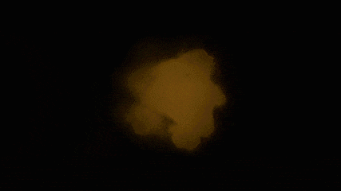
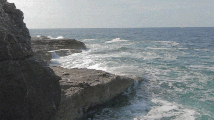

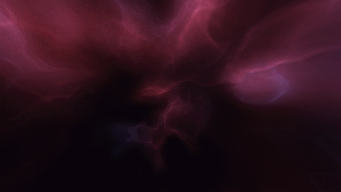

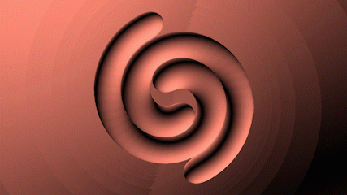
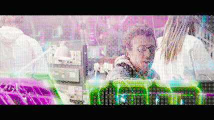

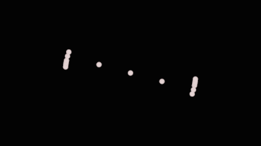
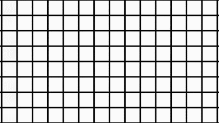
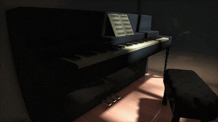
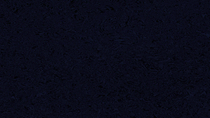

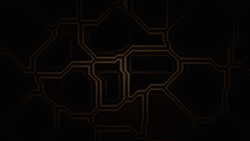
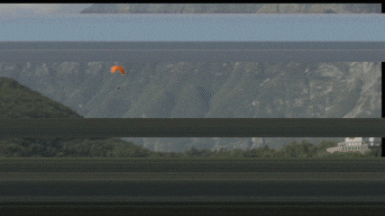
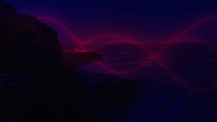

      

Verion note:
# Alpha 05 (v 1.14)

-fix layer Width and layer height downscales in glsl mode

-fix json error (the json lib is defined in the script part)

-fix glsl textures loading (input layer and external layer)

-new glsl exemple with comments

-math expression : new var name to access pixels around ([colorname]_off[index])

# Alpha 05 (v 1.13)

-New GLSL engine (for fragment shaders and based on OpenGL 3.2)

-support 32bits render

-Faster exprtk render

-Ui costumizable

# Alpha 04 (V1.12)

-new slider values range

-the preset has a name defined in thr script and now visible in the AE UI

-full json gateway from script to plugin

 Alpha 03 (v 1.11)
 
 -new script UI
 
 -new topics 
 
 -interaction with an other layer it's now possible (in topic input)
 
 
# Alpha 02 (v 1.1)
 
 -the plugin works with After Effect CC and above.
 
 -the plugin works in 8 and 16 bits (32bits coming soon) 
 
 -Possibilities to write an expression per channels
 
 -the plugin expressions can access to 4 sliders, two points and two colors pipets to comunicate with other AE elements.
 
 -presets can be saved as json files.
 
 -The expression language is based on Exprtk grammar  https://github.com/ArashPartow/exprtk
 
 
table of contents
01-HOW TO INSTALL
02- GLSL LANGAGE

 
 
**1-HOW TO INSTALL**

extract the zip file in the folder : 

On mac : /Library/Application Support/Adobe/Common/Plug-ins/7.0/MediaCore/tl

on Windows : C:\Program Files\Adobe\Common\Plug-ins\7.0\MediaCore\tl

 
**2-GLSL**
**2-1 GLSL SPECIFICATIONS**

The GLSL engine is based on opengL 3.3. You can see the specification :  https://www.khronos.org/registry/OpenGL/specs/gl/GLSLangSpec.3.30.pdf

The plugin is tested on few graphic cards but it may works on graphic card from 2011 and newer. (it works on an intel igpu 620 !)

For now (version 1.13) the plugin edits only fragment Shaders. 

Note: For the output on Macos you have to define a output vec4 like **out vec4 fragColorOut**. On windows you can define a out vec4, but gl_FragColor can also works. (version 1.13/1.14).

**2-2 SOME WEBSITE EXEMPLES**

-www.shadertoy.com is the biggest website with exemples. But using it's code in the plugin requiere some adaptations.
   -The website uses uniform input  like iTime, iResolution that the plugins has. But  the plugin is limited to 2 textures: the layer source and one external layer.
   
www.glslsandbox.com  Most of the glsl exemples can be copy past to the plugin but don't forget to keep #version 330 at the beginning of the code

**2-3 GLSL VARIABLES**

**2-3-1 UNIFORMS**

NAME| TYPE | DESCRIPTION|
---------|--------|--------|
`resolution`       | vec2  | resolution of the frame|
`iResolution`       | vec2 | resolution of the frame|
`time` | float  |  current time in seconds|
`iTime`| float  |  current time in seconds|
`layerTime_frame` | float  | current time in frames|
`layerDuration`| float  | duration of the layer in seconds|
`layerPosition`| vec3  | position of the layer (params in the transform menu on the timeline)|
`layerScale`| vec3| scale of the layer (params in the transform menu on the timeline)| |
`compFps`| float  | frame rate of the compositions|

NAME| TYPE | DESCRIPTION|
---------|--------|--------|
`layerTex`  | 2D sample | 2D texture of the effect's layer|
`extLayerTex`| 2D sample  | 2D texture of the external layer|
`var1`  |float | value of slider 1|
`var2`| float | value of slider 2|
`var3`  | float|value of slider 3|
`var4`|float  | value of slider 4|
'mouse`  | vec2 | x and y postion of point 1 but named as mouse|
`iMouse`| vec2 | x and y postion of point 1 but named as iMouse|
`pt1`  | vec2 | x and y postion of point 1|
`pt2`| vec2  | x and y postion of point 2|
`cl1`  | vec3 | rgb float values of param color 1|
`cl2`| vec3  |  rgb float values of param color 2|

