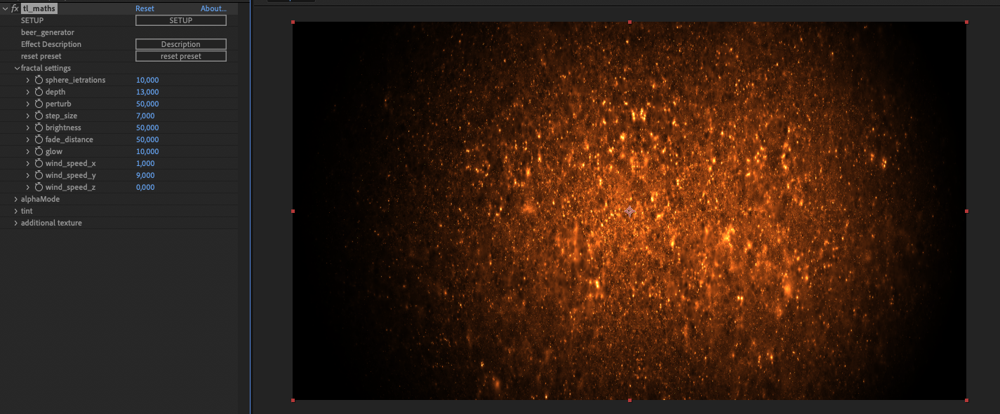
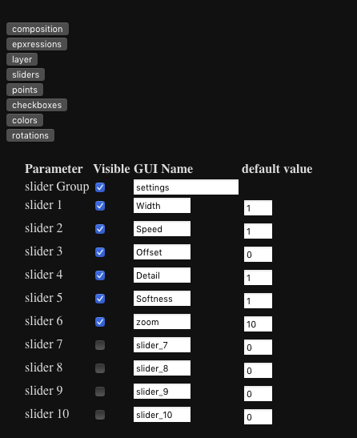

# AE_tl_math
Copyright © Thomas Laforge. 2020
Free  use  of  tl_math  is
permitted under the guidelines and in accordance with the most current
version of the https://opensource.org/licenses/gpl-3.0.html.

The plugin uses JSON for Modern C++ https://nlohmann.github.io/json/
The plugin uses ACE.js https://ace.c9.io/#nav=higlighter&api=search

An After Effect plugin project.
The user can write math expression for each pixels and by channels (RGBA) or GLSL Shaders.
In math expression mode, whatever your Color Space, the expected values are between 0 and 1.

      

Verion note:

# BETA 01 (V1.15)
-A nicer editor for shader in a panel with ACE.js API

-the panel has a library (20 exemples for now), the user can save or export it's own presets. 

-new paramaters: 10 sliders, 10 points, 10 checkboxes, 10 colors, 10 rotations.

-new settings: define a default value for each parameter and the plugin has a button to reset (for the preset)
 

 
 
 
 
 

# Alpha 05 (v 1.14)

-fix layer Width and layer height downscales in glsl mode

-fix json error (the json lib is defined in the script part)

-fix glsl textures loading (input layer and external layer)

-new glsl exemple with comments

-math expression : new var name to access pixels around ([colorname]_off[index])

# Alpha 05 (v 1.13)

-New GLSL engine (for fragment shaders and based on OpenGL 3.2)

-support 32bits render

-Faster exprtk render

-Ui costumizable

# Alpha 04 (V1.12)

-new slider values range

-the preset has a name defined in thr script and now visible in the AE UI

-full json gateway from script to plugin

 Alpha 03 (v 1.11)
 
 -new script UI
 
 -new topics 
 
 -interaction with an other layer it's now possible (in topic input)
 
 
# Alpha 02 (v 1.1)
 
 -the plugin works with After Effect CC and above.
 
 -the plugin works in 8 and 16 bits (32bits coming soon) 
 
 -Possibilities to write an expression per channels
 
 -the plugin expressions can access to 4 sliders, two points and two colors pipets to comunicate with other AE elements.
 
 -presets can be saved as json files.
 
 -The expression language is based on Exprtk grammar  https://github.com/ArashPartow/exprtk
 
 

